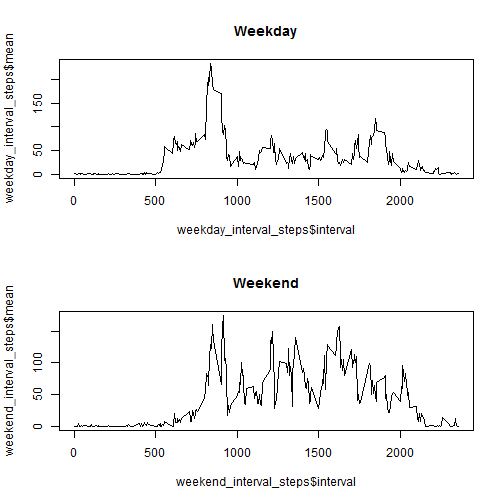

For this task we want to find pattern form the dataset that keep the activity monitor
like [Fitbit](http://www.fitbit.com/), [Nike Fuelband](http://www.nike.com/us/en_us/c/nikeplus-fuelband) or [Jawbone Up](https://jawbone.com/up), to see a user of this kind
of devices is in regular usage or in tech geeks.

First we get data from [Activity monitoring data](https://d396qusza40orc.cloudfront.net/repdata%2Fdata%2Factivity.zip).
The origin file type is zip, so we need extract the read file.


```r
zip_name <- 'activity.zip'
if( !file.exists(zip_name) ){
    zip_url <- 'https://d396qusza40orc.cloudfront.net/repdata%2Fdata%2Factivity.zip'
    download.file(url = zip_url, destfile = zip_name, method = 'curl')    
}
file_name <- 'activity.csv'
all_data <- read.csv(unz(zip_name, file_name))
```

Then get the means pre day from the whole data.


```r
library('dplyr')
```

```
## 
## Attaching package: 'dplyr'
## 
## The following object is masked from 'package:stats':
## 
##     filter
## 
## The following objects are masked from 'package:base':
## 
##     intersect, setdiff, setequal, union
```

```r
total_preday <- all_data %>%
                     group_by(date) %>%
                     summarise(sum = sum(steps, na.rm = TRUE))
                     
barplot(total_preday$sum)
axis(1, at=total_preday$date , labels=total_preday$date)
```

 

```r
(summary_data <- summary(total_preday$sum))
```

```
##    Min. 1st Qu.  Median    Mean 3rd Qu.    Max. 
##       0    6778   10400    9354   12810   21190
```

Then we know the mean and median by summary the subset.
So can try to find out the daily activity pattern. Using a time series plot help know what time zone is above avrage and contain the max steps.


```r
interval_steps <- all_data %>%
                     group_by(interval) %>%
                     summarise(mean = mean(steps, na.rm = TRUE))

plot(interval_steps$interval, interval_steps$mean, type='l')
```

 

```r
(max_interval <- interval_steps[which(interval_steps$mean==max(interval_steps$mean)), ])
```

```
## Source: local data frame [1 x 2]
## 
##   interval     mean
## 1      835 206.1698
```

Till now we ignor NA value from origin data set we can make a hypothesis that we fill the mean value to the NAs it should be not quit chage from test data we get if the user use the device reguarly, or it use it just because tech geek.

So we find the number of NAs, and fill mean value to all NA.


```r
count(all_data[is.na(all_data$steps),])
```

```
## Source: local data frame [1 x 1]
## 
##      n
## 1 2304
```

```r
fill_na <- all_data[,]
fill_na[is.na(all_data$steps), 'steps'] <- summary_data['Mean']

fill_na_preday <- fill_na %>%
                     group_by(date) %>%
                     summarise(sum = sum(steps, na.rm = TRUE))
                     
barplot(fill_na_preday$sum)
axis(1, at=fill_na_preday$date , labels=fill_na_preday$date)
```

 

```r
(summary_data <- summary(fill_na_preday$sum))
```

```
##    Min. 1st Qu.  Median    Mean 3rd Qu.    Max. 
##      41    9819   11460  362700   15080 2694000
```
 
Seem we expect the plot will be change but the value is irrational changed. So maybe the NA present also mean there shoud be no step in real situation.

Finally we want to see if the weekday or weekend effect the behavior. So we separate dataset to two parts.


```r
weekday_data <- all_data[which( as.POSIXlt(all_data$date)$wday %in% c(1:5) ),]
weekend_data <- all_data[which( ! as.POSIXlt(all_data$date)$wday %in% c(1:5) ),]

weekday_interval_steps <- weekday_data %>%
                     group_by(interval) %>%
                     summarise(mean = mean(steps, na.rm = TRUE))

weekend_interval_steps <- weekend_data %>%
                     group_by(interval) %>%
                     summarise(mean = mean(steps, na.rm = TRUE))

par(mfcol = c(2, 1))
plot(weekday_interval_steps$interval, weekday_interval_steps$mean, type='l', main = "Weekday")
plot(weekend_interval_steps$interval, weekend_interval_steps$mean, type='l', main = "Weekend")
```

 

And we can see the diffence.
